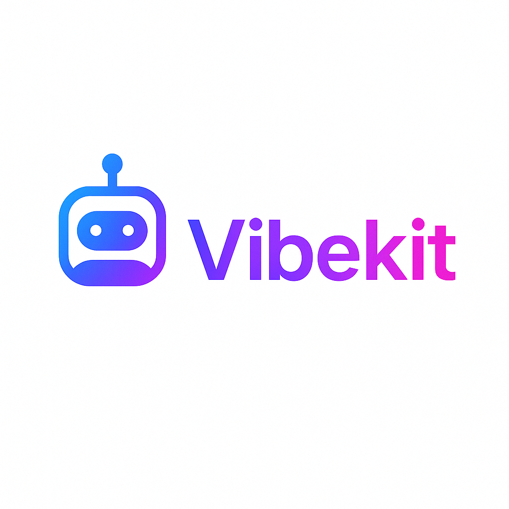

# VibeKit

<div align="center">
  
</div>

<div align="center">

**Clone. Configure. Vibe.**

*The Firebase-powered Flutter template that gets you from idea to app in minutes, not hours.*

[](https://flutter.dev/)
[](https://firebase.google.com/)
[](https://riverpod.dev/)
[](https://opensource.org/licenses/MIT)

[🚀 Quick Start](#-quick-start) • [✨ Features](#-features) • [🏗️ Architecture](#️-architecture) • [📱 Demo](#-demo) • [🤝 Contributing](#-contributing)

</div>

---

## 🎯 What is VibeKit?

VibeKit is a **vibe coding platform** — a GitHub-hosted, Firebase-powered Flutter template designed to let developers go from idea to app **without touching infrastructure**. 

Clone the repo, run the **configure CLI wizard**, and immediately begin building apps inside **Cursor IDE** with all backend services (Auth, Firestore, Storage, Functions, Hosting, Messaging) pre-wired and ready to go.

### 🎨 Perfect For

- **Solo devs & teams** building multiple productivity/utility apps
- **Startups** needing per-client deployments with consistent infrastructure  
- **Vibe coders** who want to prototype and ship ideas without boilerplate
- **Organizations** leveraging Google Workspace + Firebase who want turnkey app infrastructure

---

## 🚀 Quick Start

Get your VibeKit app running in under 10 minutes:

### 1. Clone & Setup
```bash
git clone https://github.com/nickdnj/vibekit.git
cd vibekit
flutter pub get
```

### 2. Configure Firebase (Coming Soon)
```bash
# CLI wizard will guide you through Firebase setup
npm install -g @vibekit/cli
vibekit configure
```

### 3. Run Your App
```bash
flutter run -d chrome
# or
flutter run # for mobile
```

### 4. Start Vibing! 🎉
Open in **Cursor IDE** and let the `.cursorrules` guide your development flow.

---

## ✨ Features

### 🔥 **Firebase-First Architecture**
- **Authentication**: Email/Password + Google Sign-In + Apple Sign-In
- **Database**: Firestore with optimized security rules and indexes
- **Storage**: Cloud Storage with automatic file management
- **Functions**: Serverless backend APIs ready for extension
- **Hosting**: Deploy to Firebase Hosting with one command
- **Analytics**: User behavior tracking out of the box
- **Messaging**: Push notifications ready to go

### 🎛️ **State Management & Architecture**
- **Riverpod**: Modern, type-safe state management
- **Clean Architecture**: Layered structure (UI → Providers → Repositories → Services)
- **Code Generation**: Freezed models with JSON serialization
- **Type Safety**: Fully typed with null safety

### 🔐 **Security & Admin**
- **Role-Based Access**: User/Admin roles with Firebase custom claims
- **Admin Dashboard**: Built-in user management interface
- **Security Rules**: Production-ready Firestore and Storage rules
- **App Check**: Client validation and abuse prevention

### 🎨 **Modern UI/UX**
- **Material 3**: Latest Material Design with custom theming
- **Responsive**: Works perfectly on Web, iOS, and Android
- **Dark Mode**: Automatic theme switching
- **Accessibility**: WCAG compliant components

### 🛠️ **Developer Experience**
- **Cursor Integration**: `.cursorrules` for AI-assisted development
- **Hot Reload**: Lightning-fast development cycles
- **Code Generation**: Automated boilerplate generation
- **Linting**: Consistent code style enforcement

### 🚀 **Deployment Ready**
- **CI/CD**: GitHub Actions for automated deployment
- **Multi-Platform**: Web → Firebase Hosting, iOS → App Store, Android → Play Store
- **Environment Management**: Dev/staging/production configurations

---

## 🏗️ Architecture

VibeKit follows Clean Architecture principles with unidirectional data flow:

```
┌─────────────────┐    ┌─────────────────┐    ┌─────────────────┐
│   Presentation  │───▶│   Application   │───▶│  Infrastructure │
│                 │    │                 │    │                 │
│ • Widgets       │    │ • Providers     │    │ • Repositories  │
│ • Screens       │    │ • State Mgmt    │    │ • Services      │
│ • Components    │    │ • Business Logic│    │ • Firebase SDKs │
└─────────────────┘    └─────────────────┘    └─────────────────┘
```

### 📁 Project Structure
```
lib/
├── core/
│   ├── models/          # Data models (Freezed + JSON)
│   ├── providers/       # Riverpod providers
│   ├── repositories/    # Data access layer
│   └── services/        # Business logic layer
├── features/
│   ├── auth/           # Authentication flow
│   ├── admin/          # Admin dashboard
│   ├── tasks/          # Example CRUD feature
│   └── media/          # File upload/management
└── firebase_options.dart # Firebase configuration
```

---

## 📱 Demo

### Authentication Flow
- Beautiful sign-in/sign-up screens
- Google Sign-In integration
- Password reset functionality
- Role-based navigation

### Dashboard
- Welcome screen with user stats
- Quick actions and navigation
- Admin panel access (role-gated)
- Beautiful Material 3 design

### Admin Features
- User management interface
- Role assignment capabilities
- System administration tools

---

## 🔧 Configuration

### Firebase Setup
1. Create a new Firebase project
2. Enable Authentication, Firestore, Storage, and Hosting
3. Download configuration files
4. Run the VibeKit CLI configure wizard (coming soon)

### Cursor IDE Integration
VibeKit includes `.cursorrules` that enable AI-assisted development:

```yaml
# Automatically enforces:
- Firebase-first backend usage
- Riverpod state management patterns  
- Clean architecture principles
- Consistent code scaffolding
```

---

## 🚧 Roadmap

### ✅ **Completed**
- [x] Firebase integration with all core services
- [x] Authentication system (Email + Google)
- [x] Riverpod state management setup
- [x] Clean architecture implementation
- [x] Admin dashboard foundation
- [x] Security rules and indexes

### 🔄 **In Progress**
- [ ] CLI configuration tool
- [ ] Tasks CRUD implementation
- [ ] Media upload functionality
- [ ] CI/CD workflows

### 🎯 **Coming Soon**
- [ ] MCP server integrations (PDF, FFmpeg, Graphics)
- [ ] App Store Connect deployment
- [ ] Google Play Console automation
- [ ] Template variants (task manager, notes, chat)
- [ ] Mason/Yeoman generators

---

## 🤝 Contributing

We welcome contributions! Please see our [Contributing Guide](CONTRIBUTING.md) for details.

### Development Setup
1. Fork the repository
2. Create a feature branch: `git checkout -b feature/amazing-feature`
3. Make your changes and test thoroughly
4. Commit: `git commit -m 'Add amazing feature'`
5. Push: `git push origin feature/amazing-feature`
6. Submit a pull request

---

## 📄 License

This project is licensed under the MIT License - see the [LICENSE](LICENSE) file for details.

---

## 💬 Community & Support

- **GitHub Issues**: [Report bugs or request features](https://github.com/nickdnj/vibekit/issues)
- **Discussions**: [Join the community](https://github.com/nickdnj/vibekit/discussions)
- **Documentation**: [Full docs](https://vibekit.dev) (coming soon)

---

<div align="center">

**Built with ❤️ for the vibe coding community**

*VibeKit - Where ideas become apps, and infrastructure becomes invisible.*

[⭐ Star us on GitHub](https://github.com/nickdnj/vibekit) • [🐦 Follow updates](https://twitter.com/vibekit) • [📧 Get notified](https://vibekit.dev/newsletter)

</div>